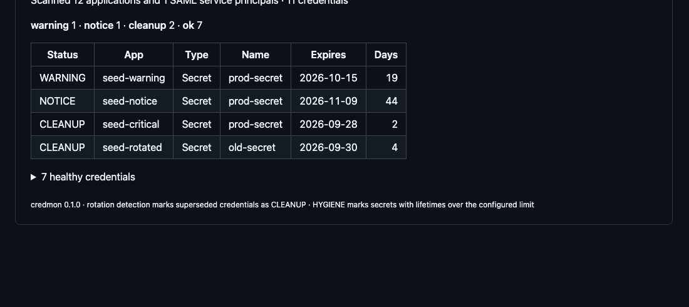
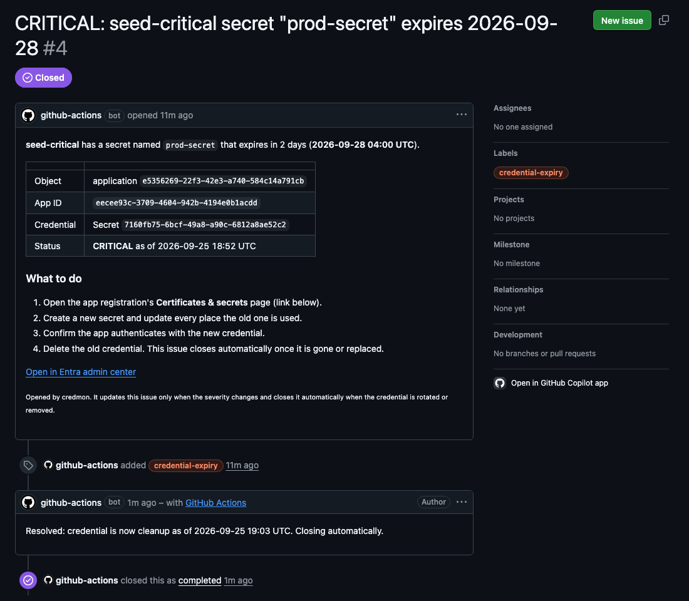

# entra-credential-monitor

A read-only monitor that finds Microsoft Entra app secrets, certificates and SAML signing certificates **before** they expire, and turns each one into a GitHub issue that opens and closes itself.

It runs daily in GitHub Actions with **no stored secrets**: the workflow authenticates to Microsoft Graph through OIDC workload identity federation, so the monitor never creates the problem it detects.

## The problem

When an app authenticates to Entra ID with a client secret or certificate, that credential has an expiry date. When it passes, the app simply stops: sign-ins fail, integrations stop syncing, and nothing warned anyone. The person who created the secret two years ago has usually left. SAML apps have the same failure in a different shape: each one has a token signing certificate, and when it expires nobody can sign in.

Entra's built-in notification covers only SAML certificates and emails whatever address was configured at the time. This tool covers secrets and certificates too, and creates tracked, accountable work instead.

## What a run looks like

Every run posts a summary to the Actions run page and uploads Markdown, CSV and JSON reports as an artifact:



Critical and expired credentials each get exactly one issue for their whole lifecycle. When the credential is rotated or removed, the monitor comments and closes it:



## How it works

| Stage | Module | What it does |
|---|---|---|
| Authenticate | `graph.py` | Gets a Graph token from `DefaultAzureCredential`: your `az login` locally, the OIDC-federated `azure/login` step in Actions. Pages through results and retries on 429, 5xx and network errors. |
| Collect | `collect.py` | Reads every application's `passwordCredentials` and `keyCredentials`, and every SAML service principal's signing certificate. Collapses the Sign, Verify and password entries Entra exposes for one SAML certificate into one row. Never copies the secret `hint`. |
| Classify | `classify.py` | Days remaining, severity, rotation detection, long-lived secret flag. `now` is always passed in, so every result is deterministic. |
| Report and notify | `report.py`, `notify.py` | Writes `summary.md`, `credentials.csv`, `credentials.json`. Opens, updates and closes issues matched by a hidden `keyId` marker, never by title. |

### Severity levels

| Status | Meaning | Issue? |
|---|---|---|
| `EXPIRED` | End date has passed | yes |
| `CRITICAL` | 7 days or fewer (configurable) | yes |
| `WARNING` | 30 days or fewer | no, report only |
| `NOTICE` | 60 days or fewer | no, report only |
| `CLEANUP` | Expiring, but the same object already has a healthy newer credential of the same type. Rotated, not an emergency. Delete the old one. | no, and closes an existing issue |
| `HYGIENE` | Healthy, but the secret's lifetime exceeds `long_lived_secret_days` | no |
| `OK` | Nothing to do | no |

Thresholds are inclusive: exactly 7 days left is critical. Excluded apps (`exclude_app_ids`) are still reported but never alerted, and never fail the run.

## Setup

### 1. Entra: a reader identity with one permission

1. Create an app registration, for example `credmon-reader`.
2. Add the Microsoft Graph **application** permission `Application.Read.All` and grant admin consent.
3. **Do not create a client secret.** Under Certificates & secrets, choose the Federated credentials tab and add a GitHub Actions credential with entity type **Environment**, your repository, and environment name `monitor`.

### 2. GitHub: an environment and two variables

1. Create an environment named `monitor`.
2. Add two **repository variables** (not secrets, these are public identifiers): `AZURE_CLIENT_ID` with the app registration's client ID, and `AZURE_TENANT_ID` with your tenant ID.

That's all. The workflow's built-in `GITHUB_TOKEN` handles issues because `monitor.yml` grants `issues: write`.

### 3. Configure and run

Edit `config.yaml`, set `tenant_id`, and either wait for the daily 12:00 UTC schedule or run the `credential-monitor` workflow from the Actions tab.

## Configuration

```yaml
thresholds:
  critical_days: 7
  warning_days: 30
  notice_days: 60
long_lived_secret_days: 365       # secrets with a longer lifetime are flagged HYGIENE
rotation_healthy_days: null       # sibling must have more than this many days left; defaults to warning_days
include_saml_certificates: true
tenant_id: <your tenant id>       # used to skip Microsoft first-party service principals
exclude_app_ids: []               # apps with formally accepted risk: reported, never alerted
fail_on: critical                 # exit non-zero at or above this level: expired, critical, warning, notice, never
```

## Local use

```bash
python3.12 -m venv .venv && source .venv/bin/activate
pip install -e ".[dev]"
az login --allow-no-subscriptions --tenant <tenant-id>

credmon scan --format table              # print to the terminal
credmon scan --out report                # write report/summary.md, credentials.csv, credentials.json
credmon notify --report report/credentials.json --dry-run   # show what issues would change
```

The exit code is 1 when any credential is at or above `fail_on`.

## Tests

```bash
pytest -q
```

Microsoft Graph and GitHub are mocked with sanitised fixtures under `tests/fixtures/`; no tenant access is needed. The suite covers the exact threshold boundaries, expired credentials, apps with no credentials, multi-page results, 429 and connection-error retries, rotation detection, the SAML triple collapse, all three report formats, and every issue lifecycle transition.

## Design decisions

- **Read-only, and the narrowest permission.** `Application.Read.All` reads applications and service principals and nothing else. `Directory.Read.All` would work but also exposes users, groups and devices this tool never needs. Graph never returns secret values after creation, so the monitor never touches a secret.
- **Federation instead of a secret.** GitHub issues a short-lived OIDC token, Entra trusts it only for this repository and the `monitor` environment, and the exchange yields a Graph token. There is nothing to leak or expire. Federated credentials don't appear in either credential list and are outside the monitor's scope by design.
- **Rotation detection.** An app with an old secret expiring tomorrow and a new one valid for a year is not an emergency. Labelling it `CLEANUP` keeps the alerts trustworthy and turns the finding into "delete the leftover".
- **One issue per credential, for life.** A new issue every day for the same secret trains people to ignore alerts. Issues are matched by a hidden marker containing the credential's `keyId`, updated only when severity changes, and closed automatically with a "resolved" comment.
- **GitHub issues instead of email.** Sending mail from an app needs `Mail.Send`, which by default can send as any mailbox in the tenant and needs extra Exchange configuration to restrict. Issues need nothing beyond the token the workflow already has.
- **SAML certificates counted once.** Entra exposes one signing certificate as a Sign key, a Verify key and a password credential. They're grouped by thumbprint so one certificate is one row, and the Sign key's `keyId` is the stable identity.

## Limitations and ideas

- Warning and notice levels are report-only. Lower `critical_days` or raise `fail_on` if you want earlier pressure.
- Owner lookup (`GET /applications/{id}/owners`) would let issues mention a person; it needs `User.ReadBasic.All` for names.
- Very large tenants could use `/applications/delta` to fetch only changes.
- Scheduled workflows in public repositories are paused after 60 days without activity; GitHub lets you re-enable them.

## License

MIT
